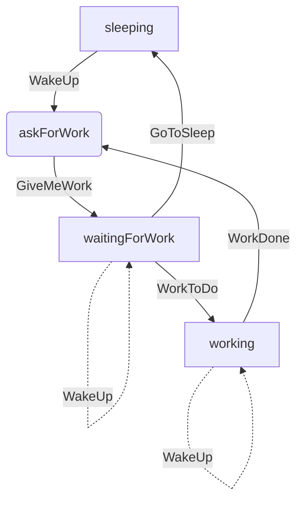
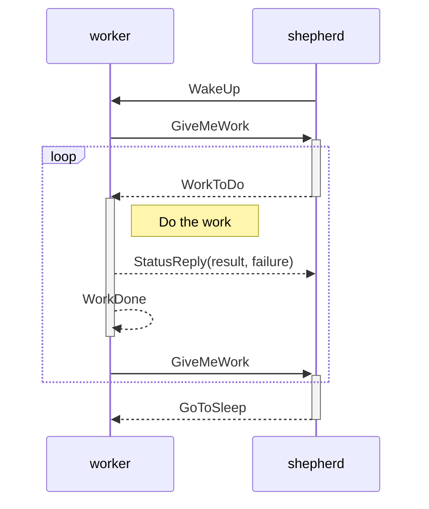
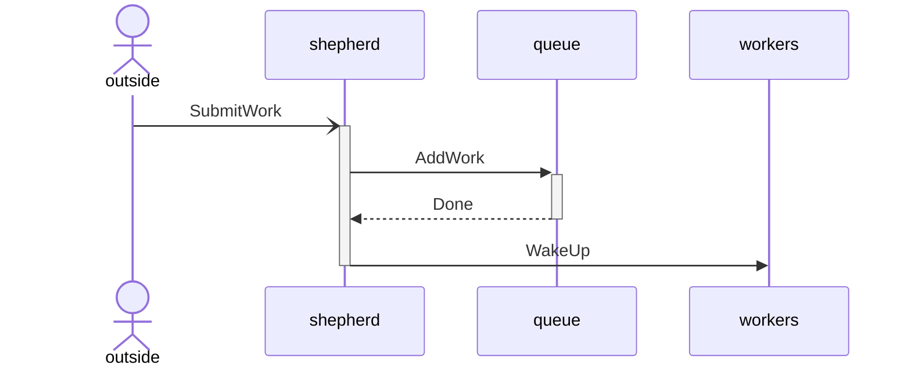
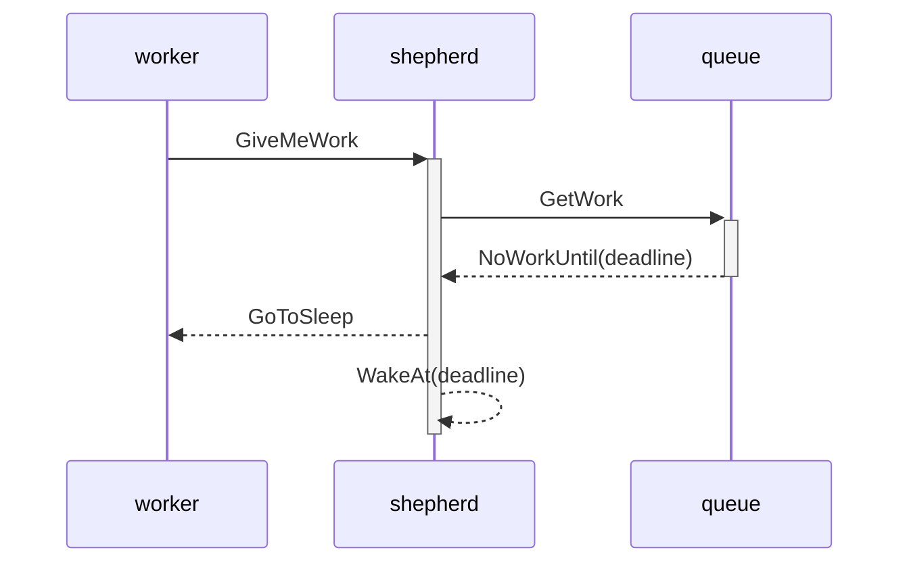
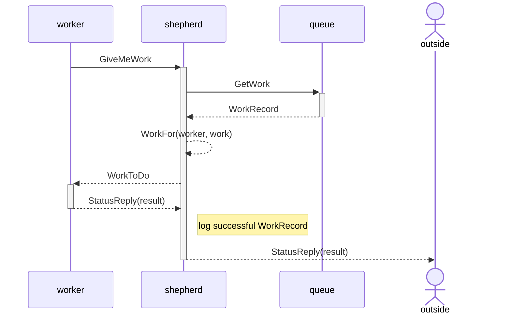
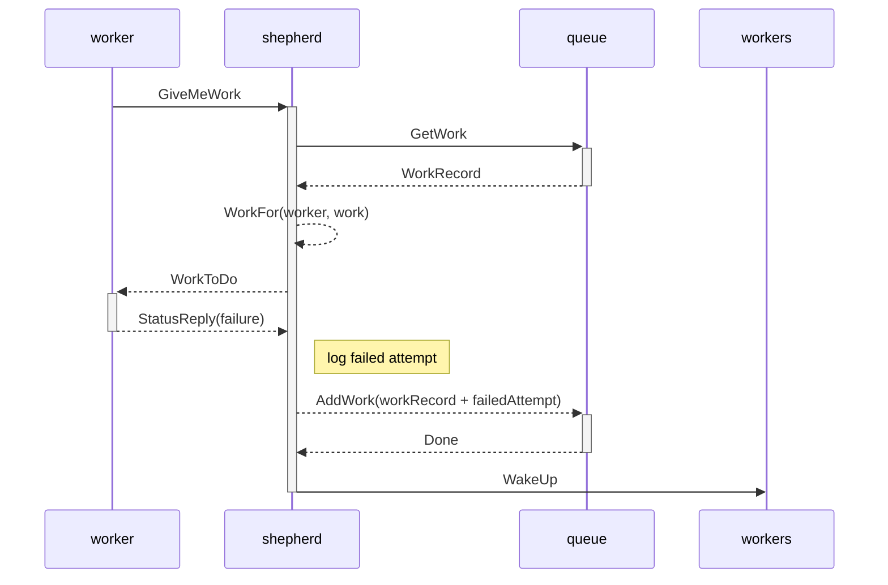
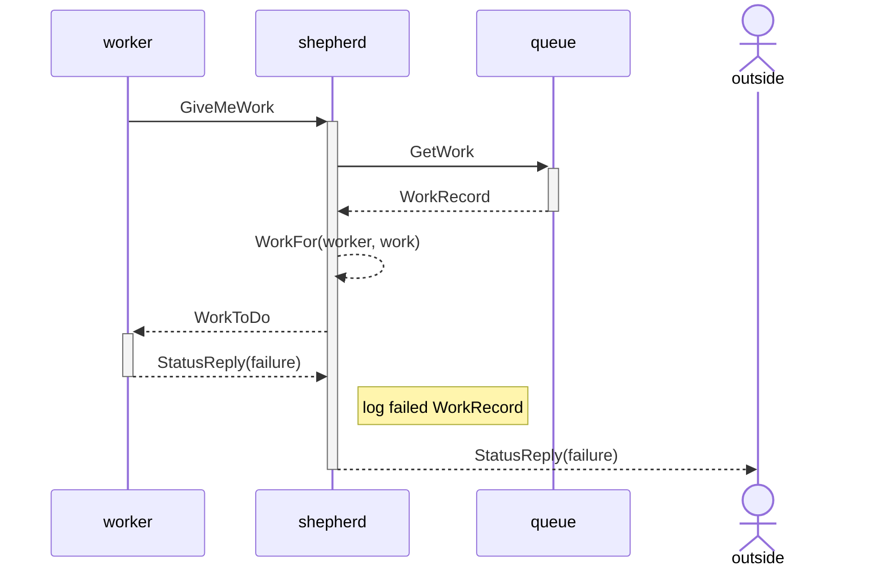

# Concurrency Limitation

Concurrency limitation is often done for
either constraining CPU impact (prevent starvation of other processing)
or connection limits (e.g. to databases).
Most resource pooling implementations work by vending
a limited set of resources to consumers
for arbitrary lengths of time,
but this is inefficient in that those consumers often hold the resources without returning them while doing other processing,
often leading to deadlocking
when the same consumers are requesting resources from multiple pools.
A better pattern is to define a set of asynchronous operations that can be submitted to the pool,
and the pooled workers can then process those operations as quickly as the resources are available,
with no dead time while additional operations are waiting.

# Basic Architecture

The pooled worker pattern consists of four main components:

1. A common queue of asynchronous operations to be done.
2. A limited number of resource instances to be used to process those operations.
3. A dedicated set of workers (one per resource instance) which actually process the operations.
4. A shepherd that spawns and handles failures of any of the above.

The following restrictions also apply:

1. All operations must be independent and idempotent.  Without independence, operations cannot be processed concurrently, and without idempotence, retries cannot be attempted.
2. Workers must not try to access any other constrained resource while processing operations.  If any other constrained resources are required, then deadlock or starvation will inevitably result.

## Queue of Operations

The queue of operations supports three basic requests: enqueue an operation (with possible delay before it's available for processing), dequeue an operation (ignoring any operations whose processing delays have not expired), and return the instantaneous count of queue entries available for processing.  To allow the possibility of persistent storage of the queue, this is modelled as an asynchronous actor.  The enqueue and dequeue operations are obviously used in system operation.  The count of queue entries is used for operational health monitoring of the overall system; the count must routinely drop below the number of workers, and alarms can be set to detect when the count remains above that threshold for too long.

## Resource Instances

The set of resource instances is the variable that is constrained to make sure that the resource is not overtaxed.  If CPU is the constrained resource, then the resource instances should be threads in a dedicated thread pool, and the thread pool should be limited to at most the number of CPU cores less one (the one core not allocated even when all threads in the pool are active ensures that other parts of the system are not starved of CPU).  For all other constrained resources, the resource pool should correspond to the maximum number of resources any given service instance should consume (e.g. database connections), and the workers can use the standard thread pool as long as they do not issue blocking operations.

## Dedicated Workers

The actual processing of operations is done by a dedicated set of workers.  A worker repeatedly requests an operation to process and then processes the operation, until there are no operations to process (at which point the worker goes to sleep).  In the course of processing the operations, the worker may reserve resource instances from the pool, or the worker may actually directly own a resource instance and be responsible for allocating the resource when the worker is created and deallocating it when the worker dies (or, conversely, dying when the resource is deallocated).

The worker cycles among 3 states: sleeping, waiting for work, and working.  The transition to the waiting for work state is done by the (shared) askForWork routine.

Message sequence:

## Shepherd

The shepherd is responsible for mediating communication between the outside world, the queue, and the workers.  No communication happens directly between those three elements without going through the shepherd, and the shepherd handles only that communication and error recovery.

When the outside world wants to enqueue an operation, that operation is sent to the shepherd.
Both the operation and a `CompletableFuture` of the operation's result are then sent to the queue, and if successfully enqueued, the shepherd responds to the outside world with the `CompletionStage` from the `CompletableFuture` (separating read and write interfaces of the async result).  If not all workers are currently busy, then the shepherd also wakes up any sleeping workers.

When a worker requests an operation to process, the shepherd attempts to dequeue an operation from the queue to give to the worker.  If such an operation is available, the shepherd records that the worker is working on that operation; otherwise the worker is told to go to sleep.  If the worker encounters any error (including processing timeout) before requesting another operation, the operation is considered to be failed and the shepherd may requeue it for (delayed) retry or discard it if too many attempts have already been made.  When an operation is successfully processed or finally discarded, the `CompletableFuture` from the queue entry is completed with the corresponding result, thus returning the result to the outside world.

No work available:

Successful work attempt:

Initial failures:

Final failure:

The shepherd may also report the instantaneous count of workers that are busy vs. sleeping for monitoring purposes, and can also keep metrics about operation processing times.

When handling worker failures (explicit uncaught exceptions or implicit timeouts), the shepherd may employ different methods of worker recovery ranging from a state reset on the worker to a full kill and restart of the worker, as circumstances dictate.  Similarly, the shepherd may reset or restart the operation queue actor if it fails for any reason.  If the shepherd cannot reset or restart the workers or the operation queue actor, it can itself die to propagate the error further up the supervision hierarchy (and likely kill the whole service).

# Other approaches

As alluded earlier, there are other approaches available for concurrency limitation that are commonly used.  Each have various benefits and pitfalls.

## Classic resource pool with reservation

Traditional resource pooling (e.g. HikariCP) maintains a limited set of resources and allows exclusive reservation of those resources by workers.  However, there is no constraint that keeps the workers from holding on to the resources while unrelated processing is done, leading to inefficient usage of the limited resource.  Also, the reservation process is usually implemented as a blocking operation, leading to thread contention and starvation for unrelated processing unless a dedicated thread pool is used.  Since the workers are arbitrary code outside the control of the resource manager, deadlock is easily achieved if a worker tries to reserve resources from multiple pools at once.  Finally, error handling is wholly in the province of the worker, and must be replicated at every usage site.  The approach outlined above avoids all these problems by providing only asynchronous access to the resource and tightly controlling the operations that may be requested before the resource is relinquished.

## Simple load balancing across multiple workers

Queue-less and shepherd-less load balancing across multiple workers is a simpler model for asynchronous operation processing.  However, such implementations allocate the operations to workers at request time instead of processing time, leading to extra latency if a given worker gets overloaded.  This can be patched with work-stealing systems, but that's an additional layer of complexity still requiring cooperation between the workers.  Also, without a shepherd, error handling is still the province of the caller and must be replicated.

Having a queue separate from the workers allows work to be processed as soon as a worker becomes available.  Having a shepherd centralizes error handling and allows consistent policies to be set.
